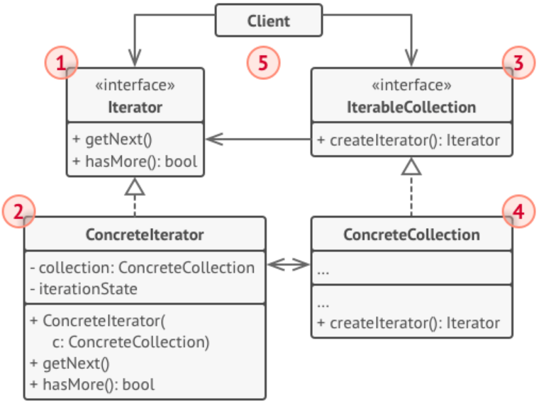

# Абстрактные классы и интерфейсы 

7.5. Ещё более сложный итератор

Задача
--------

Дан итератор. Метод next() возвращает либо String, либо итератор такой же структуры (то есть который опять возвращает или String, или такой же итератор). 

Напишите поверх этого итератора другой, уже «плоский».

Решение:
--------

    public class DeepIterator implements Iterator<String> {
    
        private Stack<Iterator> iterators;
        private String next;
        private boolean hasNext;
    
        public DeepIterator(Iterator<?> iterator) {
            this.iterators = new Stack<Iterator>();
            iterators.push(iterator);
    
            updateNext();
        }
    
        @Override
        public boolean hasNext() {
            return hasNext;
        }
    
        private void updateNext(){
    
            if(iterators.empty()){
                next = null;
                hasNext = false;
                return;
            }
    
            Iterator current = iterators.peek();
    
            if (current.hasNext()) {
                Object o = current.next();
                if (o instanceof String) {
                    next = (String) o;
                    hasNext = true;
                } else if (o instanceof Iterator) {
                    Iterator iterator = (Iterator) o;
                    iterators.push(iterator);
                    updateNext();
                } else {
                    throw new IllegalArgumentException();
                }
            } else {
                iterators.pop();
                updateNext();
            }
        }
    
        @Override
        public String next() throws NoSuchElementException {
    
            if(!hasNext){
                throw new NoSuchElementException();
            }
    
            String nextToReturn = next;
            updateNext();
            return nextToReturn;
        }
    
        @Override
        public void remove() {
            throw new UnsupportedOperationException();
        }
    }

Решение рекурсивное:

      class DeepIterator implements Iterator<String> {
        
        private Iterator subIter;
        private DeepIterator newIter;
        
        public DeepIterator(Iterator iniIter) {
            this.subIter = iniIter;
        }
        
        @Override
        public boolean hasNext() {
              if (subIter.hasNext()) return true;
              if (newIter != null) return newIter.hasNext();
              return false;
        }
        
          @Override
          public String next() {
            if(!hasNext())
                throw new NoSuchElementException();
        
               Object obj = null;
               if (newIter != null && newIter.hasNext()) obj = newIter.next();
        
               if (subIter.hasNext() && obj == null) {
                   obj = subIter.next();
        
                   if (obj instanceof Iterator && ((Iterator) obj).hasNext()) {
                       newIter = new DeepIterator((Iterator) obj);
        
                   }
               }
        
               if(obj instanceof Iterator){
                   obj = next();
               }
        
               return (String) obj;
          }
      }
